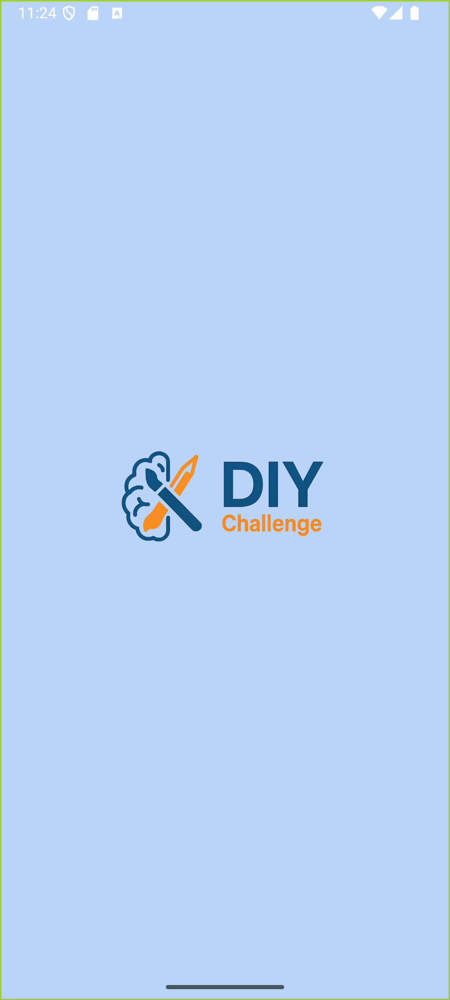
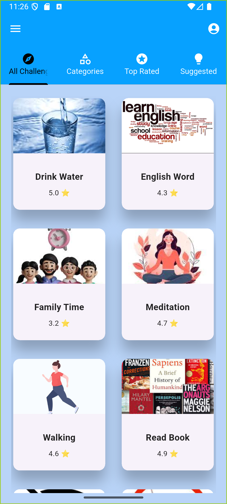
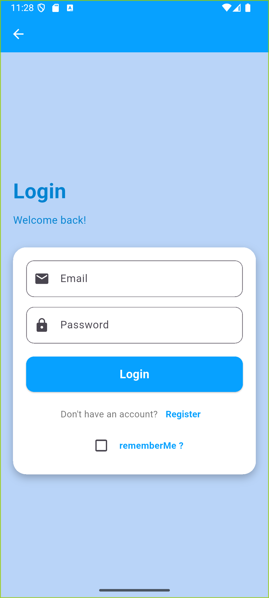
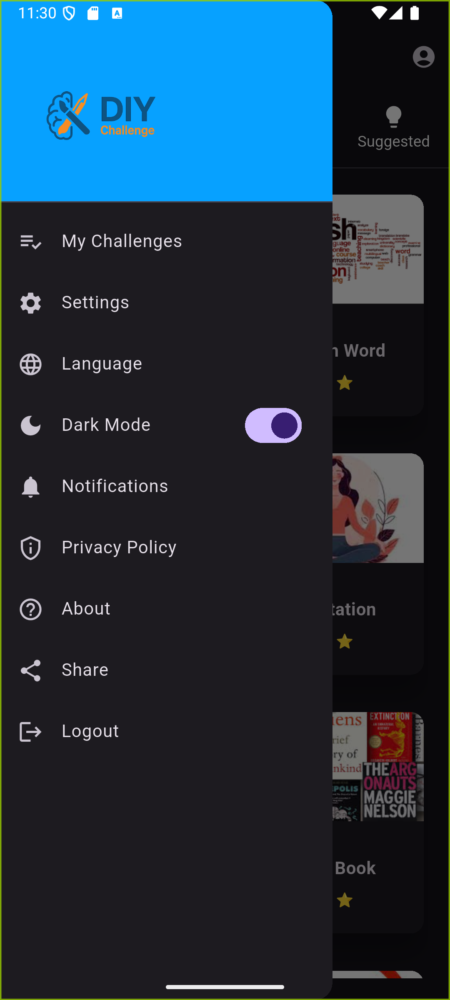
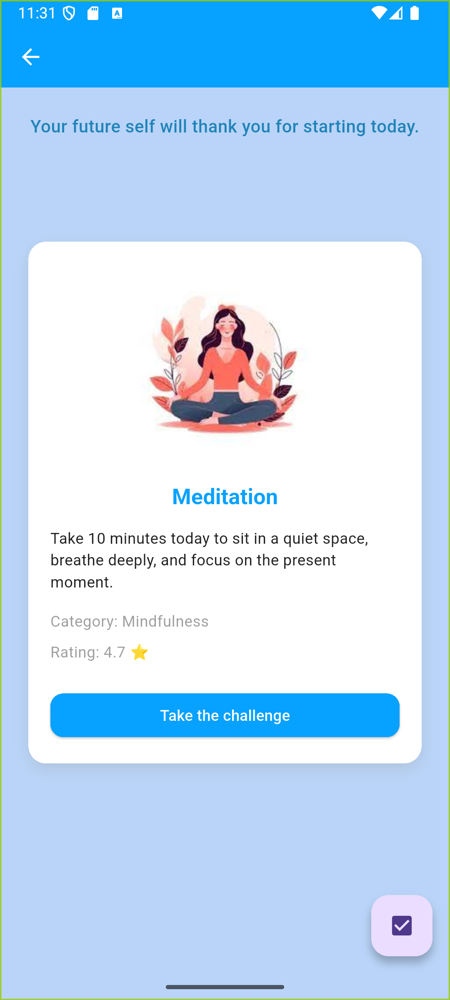
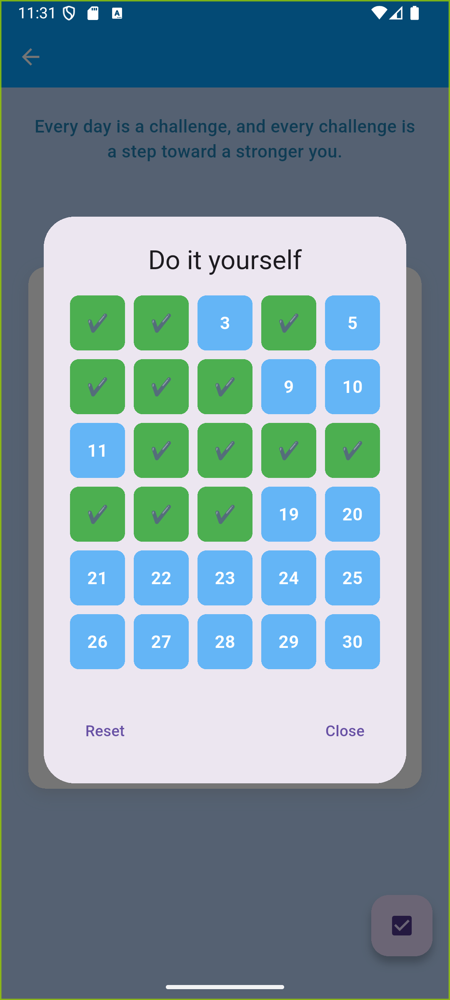
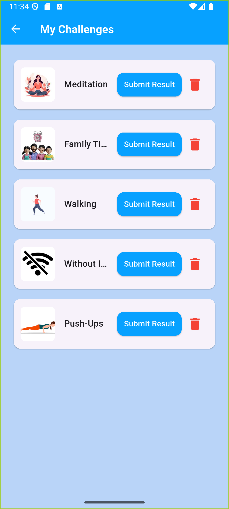

-# DIY Challenge App

A mobile application built with Flutter as part of a collaborative team project.  
The app provides a platform for showcasing and completing DIY (Do It Yourself) challenges,
with full support for bilingual content (Arabic & English) and dark them ,
responsive design, and a clean architecture using MVC and Provider.

---

##  Flutter Team Members

- Hourieh Jebawi
- Dana Khairallah
- Bara'ah Abu Ajamyia

---

##  Implemented Screens

-  Splash Screen
-  Login Page
-  Register Page
-  Home Page
-  Challenge Details Page
-  Upload Result Page
-  My Challenges Page
-  Rating Page
-  Top Rated Page
-  Upload Result Page


---

##  Packages Used

```yaml
dependencies:
  flutter:
    sdk: flutter
    cupertino_icons: ^1.0.8
    provider: ^6.1.5
    flutter_localization: ^0.3.2
    http: ^1.4.0
    image_picker: ^1.1.2
    table_calendar: ^3.0.9
## 📸 Screenshots

<div align="center">
  
  
  
  
  
  
  
</div>